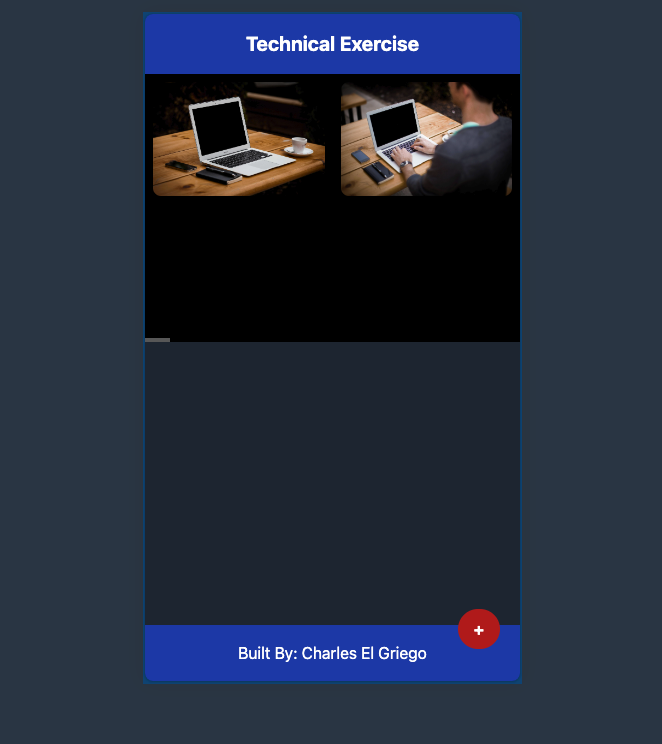
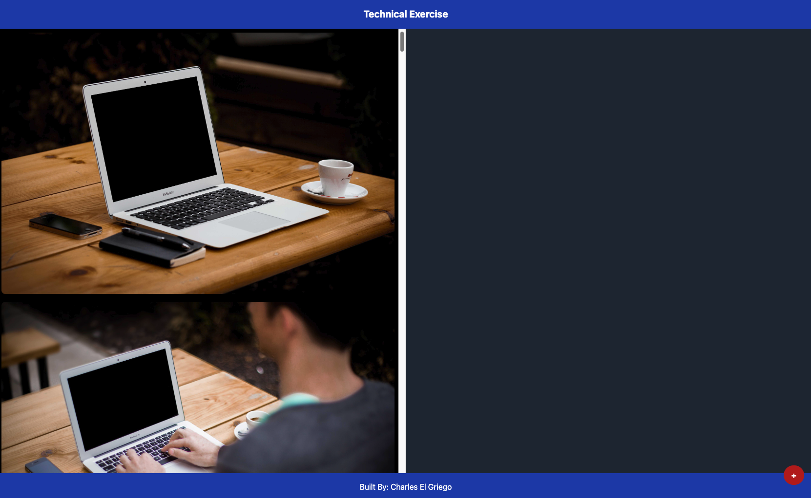

# Charles Image Viewer

## Description

Charles Image Viewer is a web application built with Angular that allows users to view and manage a collection of images. The interface is fully responsive, ensuring an optimal experience on both mobile and desktop devices.

## Features

- **Image Display**: The application displays images in a layout optimized for the device being used:
  - **Mobile Mode**: Images are presented in a horizontally scrollable list. Selecting an image displays it in detail at the bottom of the screen.
    
  - **Desktop Mode**: Images are displayed in two vertical columns; the left column shows a vertically scrollable list of images, and the right column displays the selected image in detail.
    
- **Add Images**: A floating button with a `+` symbol is always visible at the bottom-right corner of the screen. Clicking this button opens a file input dialog that allows users to select and add new images to the collection.
- **Responsive Layout**: The UI adjusts seamlessly between mobile and desktop layouts, providing an intuitive and consistent user experience across devices.

## Technologies Used

- Angular
- NgRx for state management
- Tailwind CSS for styling

## Getting Started

These instructions will get you a copy of the project up and running on your local machine for development and testing purposes.

### Prerequisites

Ensure you have Node.js v18 installed on your machine. This will include npm (Node Package Manager) which is necessary to install dependencies and run the project.

### Installing

Follow these steps to get your development environment running:

1. **Clone the repository**

   ```bash
   git clone https://github.com/CharlesElGriego/Charles-image-viewer.git

   ```

2. **Install dependencies**
   ```bash
   npm install
   ```
3. **Start the development server**
   ```bash
    npm run start
   ```
   This will start the development server and open the application in your default web browser. The application will be running at http://localhost:4200/.

## Usage

- **Viewing Images:** Simply scroll through the list of images. Click on any image to view it in detail in the designated area.
- **Adding Images:** Click the + button and select an image file from your device to add it to the viewer. The image will be processed and displayed immediately.

## License

This project is licensed under the MIT License.
